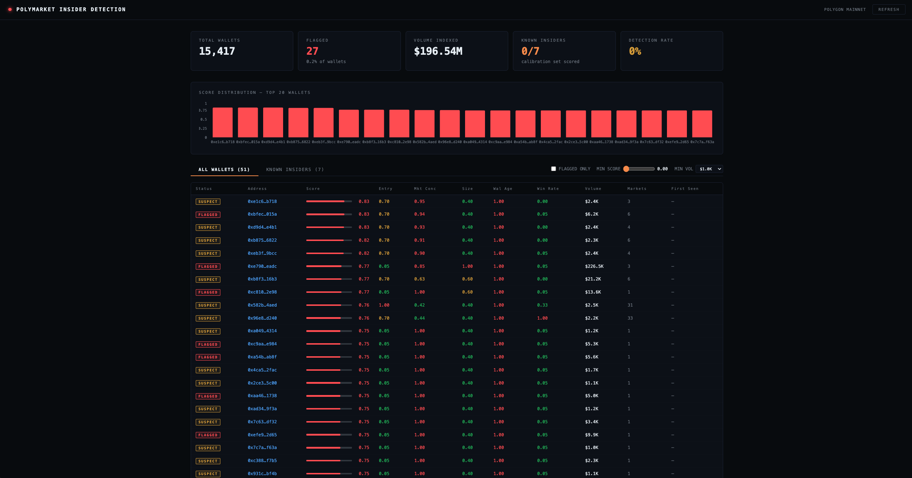
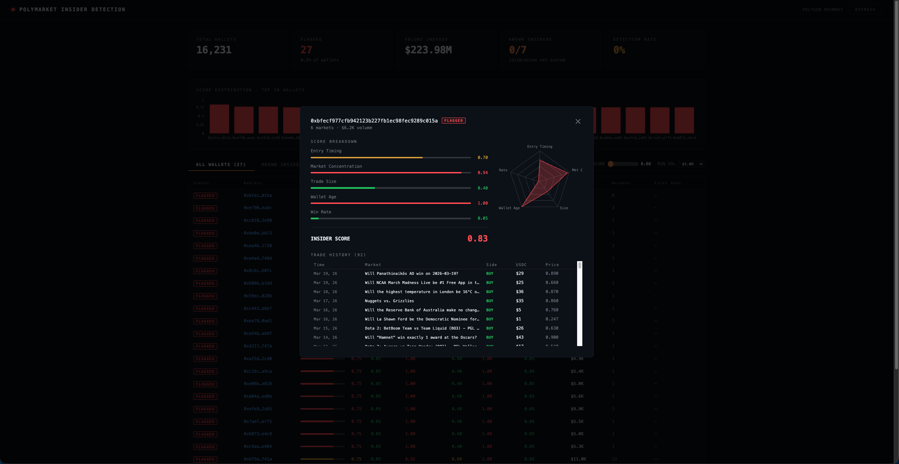
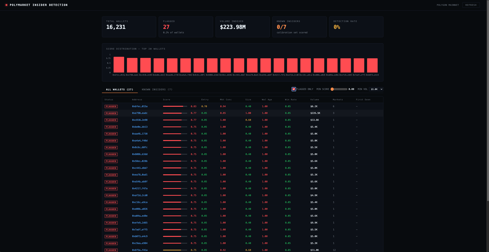

# Polymarket Insider Detection

Detects statistically anomalous wallets on Polymarket — wallets that consistently enter political and geopolitical prediction markets shortly before resolution with concentrated, high-confidence positions.

Results are written to PostgreSQL, served via a REST API, and visualised in a React dashboard.

---

## Dashboard

| Wallet List | Wallet Detail |
|---|---|
|  |  |



---

## How it works

```
Goldsky Subgraph  ──► enumerate all maker addresses in a time window
        │
  scorer binary   ──► for each wallet: fetch trades + positions (Polymarket Data API)
        │              fetch market end dates (Polymarket Gamma API)
        │              compute 5 factors → weighted composite score
        │              upsert to PostgreSQL
        ▼
  wallet_scores table
        │
  api binary (port 8080) ──► React dashboard (port 80)
```

### Scoring model

Five weighted factors (tuned against 7 known insider wallets):

| Factor | Weight | What it measures |
|---|---|---|
| Wallet Age | 0.45 | Gap between first-ever on-chain activity and first trade in political markets |
| Market Concentration | 0.25 | Fraction of all trades placed in a single market |
| Entry Timing | 0.15 | How close to resolution the wallet entered the market |
| Trade Size | 0.10 | Total USDC volume (tiered) |
| Win Rate | 0.05 | Wins / closed positions |

A wallet is **flagged** when: `score ≥ 0.70` AND `volume ≥ $4,000` AND `win_rate > 0`.
The flag is **sticky** — once true it is never reset on re-scoring.

Crypto price markets (e.g. "ETH Up or Down"), sports markets (including individual team matchups), and entertainment markets are automatically excluded from scoring — insider advantage does not apply to those categories.

---

## Prerequisites

| Tool | Version | Notes |
|---|---|---|
| Docker + Docker Compose | any recent | Required for all deployment modes |
| Rust | 1.88+ | Only needed for local development |
| `psql` | optional | Manual DB inspection |

---

## Running with Docker (recommended)

The full stack — Postgres, schema migration, API, and dashboard — starts in the correct order with a single command.

### 1. Configure environment

Create a `.env` file in the project root:

```bash
POLYMARKET_API_KEY=<your-key>
RUST_LOG=insider_detection=info
```

**Getting a Polymarket API key:** Sign in at polymarket.com → Settings → API → Create key. The key is a UUID.

> **Important:** Never commit `.env` to version control. It is listed in `.gitignore`.

Postgres credentials default to `postgres / postgres / insider_detection`. Override via environment variables if needed:

```bash
POSTGRES_USER=myuser POSTGRES_PASSWORD=mypass docker compose up --build
```

### 2. Start the full stack

```bash
docker compose up --build
```

This starts services in order:
1. **postgres** — waits until healthy
2. **migrate** — applies `migrations/0001_initial_schema.sql`, then exits
3. **api** — starts once migration completes, listens on port `8080`
4. **dashboard** — starts once the API is healthy, serves on port `80`

Open `http://localhost:80`.

### 3. Run the scorer

The scorer is intentionally separate — you control the scan window.

```bash
# Last 5 minutes
SCAN_WINDOW_FROM=$(( $(date +%s) - 300 )) \
  docker compose run --rm scorer

# Last hour
SCAN_WINDOW_FROM=$(( $(date +%s) - 3600 )) \
  docker compose run --rm scorer

# Fixed historical window (e.g. CZ pardon case, Sep 28 – Oct 24 2025)
SCAN_WINDOW_FROM=1759017600 SCAN_WINDOW_TO=1761350399 \
  docker compose run --rm scorer
```

To convert a date to a Unix timestamp:

```bash
date -d "2025-09-28" +%s        # Linux
date -j -f "%Y-%m-%d" "2025-09-28" +%s   # macOS
```

### Inspecting the database

The Postgres port is not exposed to the host in Docker. Use:

```bash
docker compose exec postgres psql -U postgres insider_detection
```

## Scoring a specific wallet on demand

### Docker (recommended)

The `score-wallet` binary is included in the same Docker image as the API. Run it via the `api` service with a custom entrypoint:

```bash
# Single address
docker compose run --rm --entrypoint ./score-wallet api 0xabc123...

# Multiple addresses
docker compose run --rm --entrypoint ./score-wallet api \
  0xabc123... \
  0xdef456...

# Re-score all known insiders
docker compose run --rm --entrypoint ./score-wallet api \
  0xee50a31c3f5a7c77824b12a941a54388a2827ed6 \
  0x6baf05d193692bb208d616709e27442c910a94c5 \
  0x0afc7ce56285bde1fbe3a75efaffdfc86d6530b2 \
  0x7f1329ade2ec162c6f8791dad99125e0dc49801c \
  0x31a56e9e690c621ed21de08cb559e9524cdb8ed9 \
  0x976685b6e867a0400085b1273309e84cd0fc627c \
  0x55ea982cebff271722419595e0659ef297b48d7c
```

> The `api` service must already be running (i.e. `docker compose up -d`) so the database is reachable.

### Local dev (Rust toolchain required)

```bash
cargo run --bin score-wallet -- 0xabc123...
# Multiple addresses:
cargo run --bin score-wallet -- 0xabc... 0xdef...
```

### API endpoint

`POST /api/score` accepts up to 10 addresses, scores them in real time, upserts to the DB, and returns the results immediately — used by the dashboard's "Score Wallet" feature.

```bash
curl -X POST http://localhost:8080/api/score \
  -H "Content-Type: application/json" \
  -d '{"addresses": ["0x7f1329ade2ec162c6f8791dad99125e0dc49801c"]}'
```

---

## Environment variables

| Variable | Required | Default | Description |
|---|---|---|---|
| `POLYMARKET_API_KEY` | **Yes** | — | Polymarket Data API Bearer token |
| `DATABASE_URL` | **Yes** | — | PostgreSQL connection string |
| `POSTGRES_USER` | No | `postgres` | Postgres username (Docker only) |
| `POSTGRES_PASSWORD` | No | `postgres` | Postgres password (Docker only) |
| `POSTGRES_DB` | No | `insider_detection` | Postgres database name (Docker only) |
| `RUST_LOG` | No | `info` | Log level (`trace` / `debug` / `info` / `warn` / `error`) |
| `PORT` | No | `8080` | Port for the API binary |
| `SCAN_WINDOW_FROM` | No | Current time at startup | Unix timestamp — start of first scan window |
| `SCAN_WINDOW_TO` | No | *(omit for perpetual mode)* | Unix timestamp — end of window |
| `POLL_INTERVAL_SECS` | No | `60` | Seconds between polls in perpetual mode |
| `POLYMARKET_DATA_API_URL` | No | `https://data-api.polymarket.com` | Override Data API base URL |
| `POLYMARKET_GAMMA_API_URL` | No | `https://gamma-api.polymarket.com` | Override Gamma API base URL |
| `GOLDSKY_SUBGRAPH_URL` | No | Public Goldsky endpoint | Override subgraph URL |

---

## API reference

All routes are under `/api`.

| Method | Path | Description |
|---|---|---|
| `GET` | `/api/health` | Health check — returns scored wallet count and flagged count |
| `GET` | `/api/stats` | Aggregate stats (total wallets, flagged count, volume, known insiders) |
| `GET` | `/api/wallets` | Paginated wallet list with score breakdown |
| `GET` | `/api/wallets/:address` | Single wallet detail + known-insider label |
| `GET` | `/api/wallets/:address/trades` | Live trade history (proxies Polymarket Data API) |
| `GET` | `/api/known-insiders` | Calibration set of known insider wallets with scores |
| `POST` | `/api/score` | Score one or more wallet addresses on demand, upsert to DB, return results |

**Query parameters for `GET /api/wallets`:**

| Param | Default | Description |
|---|---|---|
| `flagged_only` | `false` | Return only flagged wallets |
| `min_score` | `0` | Minimum composite score (0–1) |
| `min_volume_usdc` | `1000` | Minimum total USDC volume |
| `limit` | `100` | Page size (max 500) |
| `offset` | `0` | Pagination offset |

**Request body for `POST /api/score`:**

```json
{ "addresses": ["0xabc123...", "0xdef456..."] }
```

Maximum 10 addresses per request. Returns an array of wallet score objects in the same shape as `GET /api/wallets`.

---

## Running tests

```bash
cargo test
```

18 unit tests covering scoring factor tiers, composite arithmetic, the two-pass market filter, flag conditions, and date parsing.

---

## Project structure

```
insider-detection/
├── src/
│   ├── lib.rs                  # Module declarations
│   ├── bin/
│   │   ├── scorer.rs           # scorer binary — subgraph enumeration + scoring pipeline
│   │   ├── api.rs              # api binary — Axum REST server
│   │   └── score_wallet.rs     # score-wallet binary — on-demand CLI wallet scoring
│   ├── subgraph/
│   │   └── orderbook.rs        # Goldsky GraphQL client (paginated wallet enumeration)
│   ├── data_api/
│   │   └── client.rs           # Polymarket Data API client (trades, positions, activity)
│   ├── gamma/
│   │   └── client.rs           # Polymarket Gamma API client (market end dates, cached)
│   ├── scorer/
│   │   ├── factors.rs          # Pure factor functions + unit tests
│   │   └── model.rs            # Scoring pipeline, DB upsert
│   └── api/
│       └── routes.rs           # Axum route handlers
├── migrations/
│   └── 0001_initial_schema.sql # wallet_scores, known_insiders, scorer_state tables + seed data
├── dashboard/
│   ├── src/
│   │   ├── App.tsx             # Main dashboard UI
│   │   └── lib/api.ts          # Typed REST client
│   ├── nginx.conf              # nginx config — serves static files, proxies /api to api:8080
│   ├── Dockerfile              # Multi-stage: node build → nginx serve
│   ├── vite.config.ts
│   └── package.json
├── docs/
│   └── screenshots/            # Dashboard screenshots for README
├── Dockerfile                  # Multi-stage: cargo-chef dep cache → release build → slim runtime
├── docker-compose.yml          # postgres → migrate → api → dashboard (sequential startup)
├── .sqlx/                      # sqlx offline query cache (required for Docker build)
├── Cargo.toml
└── .env                        # Local config — never commit this
```

---

## Known insider calibration set

Seven wallets with publicly confirmed insider trading activity are seeded into `known_insiders` on first migration. The dashboard's **Known Insiders** tab shows their current detection status.

| Wallet | Label | Event |
|---|---|---|
| `0xee50a3…ed6` | Google d4vd | Google acquires character.ai |
| `0x6baf05…c5` | Maduro SBet365 | Maduro leaving power |
| `0x0afc7c…b2` | Israel Iran ricosuave | Israel–Iran ceasefire |
| `0x7f1329…1c` | Trump pardon CZ | CZ presidential pardon |
| `0x31a56e…d9` | Maduro unnamed | Maduro leaving power |
| `0x976685…6c` | Micro Strategy fromagi | MicroStrategy stock bet |
| `0x55ea98…7c` | DraftKings flaccidwillie | DraftKings acquisition |

Re-score all of them at once — see the [score-wallet Docker command](#docker-recommended) above.
